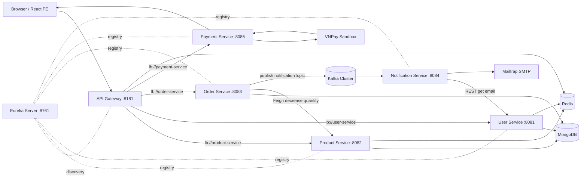

# Báo cáo phân tích nghiệp vụ, kiến trúc hệ thống và quy trình phát triển với GenAI cho ProjectWeb

## Tóm tắt điều hành

ProjectWeb là một hệ thống thương mại điện tử được xây dựng theo hướng microservices. Frontend sử dụng React/Vite; backend sử dụng Spring Boot với các service tách biệt cho user, product, order, payment, notification, API Gateway và Eureka Server. Hệ thống hiện có các thành phần hạ tầng quan trọng như MongoDB, Redis, Kafka, Docker Compose, Kubernetes manifest cơ bản, Prometheus metrics và Zipkin tracing.

Về nghiệp vụ, hệ thống đã bao phủ các luồng chính của ecommerce: xem sản phẩm, quản lý giỏ hàng ở frontend, đăng ký/đăng nhập, đặt hàng, trừ tồn kho, thanh toán VNPay, gửi email thông báo và theo dõi/hủy đơn. Tuy nhiên, một số điểm cần hoàn thiện trước khi vận hành nghiêm túc là xác thực/phân quyền backend, đồng bộ contract frontend/backend, quản lý transaction giữa order-inventory-payment, cấu hình secret, retry cho notification và hoàn thiện triển khai Kubernetes.

Nếu phát triển lại toàn bộ hệ thống từ đầu với GenAI, GenAI nên được dùng xuyên suốt vòng đời phát triển phần mềm: phân tích yêu cầu, thiết kế kiến trúc, lập kế hoạch sprint, sinh skeleton code, tạo test case, review bảo mật, hỗ trợ CI/CD, viết runbook và cập nhật tài liệu. GenAI đóng vai trò tăng tốc và kiểm tra chéo, còn con người vẫn chịu trách nhiệm chốt nghiệp vụ, quyết định kiến trúc, review code, kiểm thử và nghiệm thu.

## 1. Phạm vi phân tích

Tài liệu này được tổng hợp từ mã nguồn hiện tại trong workspace, gồm:

- Frontend: `FE/src`, `FE/package.json`, cấu hình Vite, Docker và biến môi trường.
- Backend: `BE/pom.xml`, các service Spring Boot trong `BE/*-service`, `BE/api-gateway`, `BE/eureka-server`.
- Hạ tầng local/deploy: `BE/docker-compose.yml`, `BE/k8s/*.yaml`, Dockerfile từng service.

Mục tiêu của hệ thống là một nền tảng ecommerce dạng microservices, cho phép người dùng xem sản phẩm, quản lý giỏ hàng, đăng ký/đăng nhập, đặt hàng, thanh toán VNPay, theo dõi/hủy đơn hàng và nhận email thông báo khi đặt hàng.

## 2. Tổng quan nghiệp vụ

### 2.1. Tác nhân chính

| Tác nhân | Vai trò |
| --- | --- |
| Khách vãng lai | Xem danh sách sản phẩm, thêm sản phẩm vào giỏ cục bộ, được yêu cầu đăng nhập khi đặt hàng. |
| Người dùng đã đăng nhập | Đặt hàng, chọn hình thức giao hàng, chọn phương thức thanh toán, xem danh sách đơn hàng, hủy đơn hàng. |
| Quản trị viên | Truy cập dashboard nếu `isAdmin = true`, xem/tạo sản phẩm, truy cập màn hình đơn hàng và người dùng. |
| Hệ thống | Trừ tồn kho, lưu đơn hàng, phát sự kiện Kafka, gửi email thông báo, tạo URL thanh toán VNPay. |

### 2.2. Năng lực nghiệp vụ chính

1. Quản lý tài khoản:
   - Đăng ký tài khoản mới bằng `username`, `email`, `password`.
   - Kiểm tra trùng email.
   - Mã hóa mật khẩu bằng BCrypt.
   - Tạo JWT sau đăng ký/đăng nhập.
   - Lưu token vào Redis với thời gian sống 1 ngày.
   - Đăng xuất bằng cách xóa token khỏi Redis.

2. Danh mục sản phẩm:
   - Lấy danh sách sản phẩm phân trang.
   - Lấy chi tiết sản phẩm theo `id`.
   - Tạo sản phẩm mới.
   - Nếu `productCode` đã tồn tại, tăng số lượng tồn kho thay vì tạo bản ghi mới.
   - Trừ số lượng tồn kho khi có đơn hàng.

3. Giỏ hàng:
   - Giỏ hàng được quản lý ở frontend bằng reducer.
   - Dữ liệu giỏ hàng được cache bằng `localforage`.
   - Backend hiện không có cart-service riêng; các endpoint `add-to-cart` và `remove-from-cart` trong product-service không được frontend dùng cho giỏ hàng thực tế.

4. Đặt hàng:
   - Người dùng chọn loại giao hàng, nhập số điện thoại, chọn phương thức thanh toán.
   - Frontend gửi payload đơn hàng sang order-service.
   - Order-service kiểm tra `user_id`, chuẩn hóa phương thức thanh toán, trừ tồn kho qua product-service, lưu đơn hàng MongoDB và phát sự kiện Kafka.
   - Trạng thái ban đầu của đơn hàng là `PENDING`.

5. Thanh toán:
   - Hỗ trợ COD và VNPay.
   - Với VNPay, frontend tạo đơn trước, sau đó gọi payment-service để tạo payment URL.
   - Payment-service ký tham số bằng HMAC SHA512 và redirect người dùng sang sandbox VNPay.
   - Khi VNPay trả về, payment-service xác thực chữ ký và redirect về frontend `/payment/result`.

6. Thông báo:
   - Order-service phát event JSON vào Kafka topic `notificationTopic`.
   - Notification-service consume topic này, lấy email người dùng từ user-service, rồi gửi email qua Mailtrap SMTP.

7. Quản trị:
   - Frontend có route `/dashboard`.
   - Route admin được bảo vệ ở client bằng `user.isAdmin`.
   - Màn hình quản lý sản phẩm đã có chức năng gọi API tạo sản phẩm.
   - Màn hình users hiện chỉ là placeholder.
   - Màn hình orders có UI nhưng còn lệch với cách truyền dữ liệu hiện tại.

## 3. Kiến trúc tổng thể

Hệ thống được chia thành frontend React và backend Spring Boot microservices. API Gateway là điểm vào backend, định tuyến request sang các service thông qua Eureka service discovery.



### 3.1. Công nghệ chính

| Lớp | Công nghệ |
| --- | --- |
| Frontend | React 18, Vite, React Router, Tailwind CSS, lucide-react, react-toastify, localforage |
| Backend | Java 21, Spring Boot 3.4.4, Spring Web/WebFlux, Spring Cloud Gateway, Eureka, OpenFeign |
| Lưu trữ | MongoDB cho user/product/order; Redis cho token/cache/rate limit |
| Messaging | Apache Kafka, topic `notificationTopic` |
| Payment | VNPay sandbox |
| Email | Spring Mail + Mailtrap SMTP |
| Quan sát hệ thống | Actuator, Prometheus metrics, Zipkin tracing |
| Đóng gói | Docker, Docker Compose, Kubernetes manifest cơ bản |

### 3.2. Cổng và URL chính

| Thành phần | Port | Ghi chú |
| --- | ---: | --- |
| FE Vite | 5173 | Dev frontend |
| API Gateway | 8181 | Public entrypoint backend |
| Eureka Server | 8761 | Service registry |
| User Service | 8081 | Tài khoản, JWT, Redis token |
| Product Service | 8082 | Catalog, tồn kho, cache |
| Order Service | 8083 | Đặt hàng, trạng thái đơn, Kafka producer |
| Notification Service | 8084 | Kafka consumer, email |
| Payment Service | 8085 | VNPay payment URL và return callback |
| MongoDB | 27017 | Database mặc định `database` |
| Redis | 6379 | Token/cache/rate limit |
| Kafka UI | 8080 | Quan sát Kafka |
| Prometheus | 9090 | Metrics |
| Zipkin | 9411 | Distributed tracing |

### 3.3. Entry point frontend

Frontend gọi API qua biến môi trường:

- Development: `VITE_API_URL="http://localhost:8181/v1/api"`
- Production Docker: `VITE_API_URL=http://api-gateway:8181/v1/api`

Vì `VITE_API_URL` đã bao gồm `/v1/api`, frontend gọi các path ngắn như `/products`, `/user/login`, `/order/place-order`, `/payment/create-payment`.

## 4. Luồng nghiệp vụ chi tiết

### 4.1. Luồng xem sản phẩm

1. `App.jsx` gọi `store.getProductsByPage()` khi khởi động nếu state chưa có sản phẩm.
2. Frontend gọi `GET {VITE_API_URL}/products?page=0&size=9`.
3. Gateway route request `/v1/api/products/**` tới `lb://product-service`.
4. Product-service truy vấn MongoDB qua `ProductRepo.findAll(Pageable)`.
5. Kết quả được map sang `ProductDTO` và cache Redis theo key `pageNumber-pageSize`.
6. Frontend gắn thêm `addedToCart: false` và lưu vào state.

### 4.2. Luồng đăng ký

1. Người dùng mở modal register và nhập `username`, `email`, `password`, `confirmPassword`.
2. Frontend gửi `POST /v1/api/user/register`.
3. User-service kiểm tra email đã tồn tại chưa.
4. Mật khẩu được BCrypt.
5. `isAdmin` mặc định là `false`, `expirationDate` đặt `86400`.
6. User được lưu vào MongoDB collection `userDB`.
7. Service sinh JWT chứa `email`, `role`, `id`, `username`.
8. JWT được lưu Redis trong 1 ngày.
9. API trả về `message`, `token`, `user`.

### 4.3. Luồng đăng nhập/đăng xuất

Đăng nhập:

1. Frontend gửi `POST /v1/api/user/login`.
2. User-service tìm user theo email.
3. BCrypt kiểm tra mật khẩu.
4. Sinh JWT và lưu Redis 1 ngày.
5. Frontend lưu `user` và `token` vào `localStorage`.

Đăng xuất:

1. Frontend lấy `token` từ `localStorage`.
2. Gửi `GET /v1/api/user/logout` với header `Authorization: Bearer <token>`.
3. User-service kiểm tra token có trong Redis không.
4. Nếu có, xóa token khỏi Redis và frontend xóa `localStorage`.

### 4.4. Luồng thêm giỏ hàng

1. Người dùng bấm thêm sản phẩm.
2. Frontend reducer tìm sản phẩm trong `state.products`.
3. Gán `addedToCart = true`, set `quantity = 1`.
4. Cập nhật `cart`, `cartQuantity`, `cartTotal`.
5. Ghi backup vào `localforage` key `cartItems`.

Backend không lưu giỏ hàng. Điều này làm giỏ hàng phụ thuộc vào trình duyệt hiện tại.

### 4.5. Luồng đặt hàng COD

1. Người dùng nhập số điện thoại, chọn delivery type và payment method.
2. Frontend dựng payload:
   - `items`: danh sách sản phẩm trong cart.
   - `totalItemCount`: số lượng item.
   - `delivery_type`, `delivery_type_cost`.
   - `cost_before_delivery_rate`, `cost_after_delivery_rate`.
   - `promo_code`, `contact_number`.
   - `user_id`.
   - `paymentMethod`.
3. Gọi `POST /v1/api/order/place-order`.
4. Order-service kiểm tra `user_id != null`.
5. Order-service gọi `PaymentMethod.fromCode(paymentMethod)`.
6. Với từng sản phẩm trong order, order-service gọi Feign tới product-service:
   - `PUT /v1/api/products/{id}/decrease-quantity?amount=<quantity>`
7. Product-service kiểm tra tồn kho và trừ `quantity`.
8. Order-service lưu Order vào MongoDB collection `orderDB`, status `PENDING`.
9. Order-service publish Kafka event:
   - Topic: `notificationTopic`
   - Payload: `{"message":"Order placed successfully with id: ...", "userId":"..."}`
10. Notification-service nhận event, gọi user-service lấy email và gửi email.
11. Frontend thông báo đặt hàng thành công và clear cart.

### 4.6. Luồng đặt hàng VNPay

1. Các bước tạo order giống COD, gồm cả trừ tồn kho và lưu đơn hàng trước.
2. Nếu `paymentMethod === "VNPAY"`, frontend gọi:
   - `GET /v1/api/payment/create-payment?amount=<amount>`
3. Payment-service tạo bộ tham số VNPay:
   - Version `2.1.0`
   - Command `pay`
   - Currency `VND`
   - TxnRef random 8 chữ số
   - Return URL từ `PaymentConfig.vnp_ReturnUrl`
   - Create date và expire date 15 phút
4. Payment-service ký hash bằng `secretKey` và trả `{ code, message, url }`.
5. Frontend redirect browser sang `url`.
6. VNPay redirect về payment-service endpoint `payment-return`.
7. Payment-service xác thực `vnp_SecureHash`.
8. Nếu response code `00`, redirect frontend tới:
   - `http://localhost:5173/payment/result?vnp_ResponseCode=00`
9. Frontend `PaymentResult` hiển thị kết quả.

### 4.7. Luồng xem và hủy đơn hàng

Xem đơn hàng:

1. Frontend `DeliveryView` kiểm tra đã login chưa.
2. Gọi `GET /v1/api/order/{user_id}/get-orders`.
3. Order-service query MongoDB theo field `user_id`.
4. Trả danh sách `Payload`.

Hủy đơn hàng:

1. Frontend mở cancel modal và gửi `POST /v1/api/order/cancel-order` với `{ id }`.
2. Order-service tìm order theo id.
3. Set `status = "CANCELED"`.
4. Lưu lại MongoDB và trả order đã cập nhật.

Hiện tại cancel không hoàn tồn kho và không phát email thông báo hủy.

## 5. Chi tiết từng service

## 5.1. Frontend service/app

### Chức năng

Frontend là single-page application dùng React Router. Các màn hình chính:

| Route | Component | Chức năng |
| --- | --- | --- |
| `/` | `HomeView` | Banner, benefits, product list, deals, top products |
| `/cart` | `CartView` | Giỏ hàng và checkout |
| `/delivery` | `DeliveryView` | Danh sách đơn hàng của user, reload/hủy đơn |
| `/dashboard` | `AdminView` | Layout dashboard admin |
| `/dashboard/product` | `ProductTable` | Danh sách sản phẩm, tạo sản phẩm |
| `/dashboard/orders` | `OrdersTable` | UI danh sách đơn hàng |
| `/dashboard/users` | `UsersTable` | Placeholder |
| `/payment/result` | `PaymentResult` | Kết quả callback VNPay |

### Quản lý state

Frontend không dùng Redux, mà dùng custom hooks + Context:

- `GlobalContext`: gom `store`, `auth`, `modal`, `orders`.
- `store/products.js`: sản phẩm, cart, tổng tiền, checkout, gọi product/order/payment API.
- `store/auth.js`: register, login, logout, localStorage token/user.
- `store/orders.js`: lấy đơn hàng, chọn order cần hủy, hủy đơn.
- `store/modal.js`: trạng thái login/register modal và cancel modal.

### Dữ liệu client-side

- `localStorage.user`: thông tin user đang đăng nhập, gồm `expirationDate` do frontend tự set.
- `localStorage.token`: JWT do user-service trả về.
- `localforage.cartItems`: backup giỏ hàng.

### API frontend đang gọi

| Frontend call | Backend thực tế qua gateway |
| --- | --- |
| `/products?page=&size=` | `GET /v1/api/products` |
| `/products` | `POST /v1/api/products` |
| `/user/register` | `POST /v1/api/user/register` |
| `/user/login` | `POST /v1/api/user/login` |
| `/user/logout` | `GET /v1/api/user/logout` |
| `/order/place-order` | `POST /v1/api/order/place-order` |
| `/order/{userId}/get-orders` | `GET /v1/api/order/{userId}/get-orders` |
| `/order/cancel-order` | `POST /v1/api/order/cancel-order` |
| `/payment/create-payment?amount=` | `GET /v1/api/payment/create-payment` |

### Nhận xét

- Frontend đang chịu trách nhiệm khá nhiều nghiệp vụ cart và admin guard.
- Kiểm tra quyền admin chỉ nằm ở client bằng `user.isAdmin`; backend chưa chặn endpoint admin.
- `PaymentButton.jsx` import `../services/paymentService`, nhưng repo hiện không có file service tương ứng; component này có vẻ không được dùng trong route chính.
- `OrdersTable` tạo hook `useOrders()` riêng và nhận `userId` prop, nhưng route hiện không truyền prop nên màn hình admin orders có thể không lấy đúng dữ liệu.
- `ProductTable` hiển thị `category` và `stock`, trong khi backend model có `quantity`, `productCode`, không có `category`/`stock`.

## 5.2. API Gateway

### Vai trò

API Gateway là entrypoint backend tại port `8181`, dùng Spring Cloud Gateway reactive. Gateway định tuyến request theo path và service name trong Eureka.

### Route

| Route ID | Predicate | URI |
| --- | --- | --- |
| `product-service` | `/v1/api/products/**` | `lb://product-service` |
| `order-service` | `/v1/api/order/**` | `lb://order-service` |
| `user-service` | `/v1/api/user/**` | `lb://user-service` |
| `payment-service` | `/v1/api/payment/**` | `lb://payment-service` |

### CORS và bảo mật

- Allowed origins mặc định: `http://localhost:5173,http://frontend:5173`.
- Cho phép methods: `GET`, `POST`, `PUT`, `DELETE`, `OPTIONS`.
- Tắt CSRF.
- Tất cả exchange hiện `permitAll`.
- OAuth2 resource server/JWT validation đang bị comment.

### Rate limiting

Gateway cấu hình `RequestRateLimiter` cho route product:

- `replenishRate=10`
- `burstCapacity=20`
- key theo IP client qua bean `ipKeyResolver`

### CachingGatewayFilter

Repo có `CachingGatewayFilter` dùng Redis để cache response 10 phút theo URI. Tuy nhiên:

- Field `RedisTemplate<String, String> redisTemplate` không phải `final` và không có `@Autowired`, nên `@RequiredArgsConstructor` không inject field này.
- Filter chưa được gắn vào route trong `application.properties`.
- Nếu được kích hoạt nguyên trạng, filter có nguy cơ `NullPointerException`.

## 5.3. Eureka Server

### Vai trò

Eureka Server chạy tại port `8761`, là service registry cho gateway và các service backend.

### Cấu hình

- `@EnableEurekaServer`.
- `register-with-eureka=false`, `fetch-registry=false` vì nó là registry server.
- Self-preservation tắt: `enable-self-preservation=false`.
- Có Basic Auth:
  - user: `admin`
  - password: `password`
- `/eureka/**` được permit, các request khác yêu cầu authenticated.

### Nhận xét

- Các service client cấu hình `spring.security.user.name=eureka`, `password=password`, nhưng Eureka server dùng `admin/password`.
- URL Eureka mặc định của service là `http://localhost:8761/eureka/`, không chứa Basic Auth. Vì `/eureka/**` đang permit nên việc đăng ký vẫn có thể hoạt động, nhưng cấu hình credential chưa thống nhất.

## 5.4. User Service

### Vai trò

User-service quản lý tài khoản, đăng nhập, JWT token và cung cấp email user cho notification-service.

### Cổng và cấu hình

- Service name: `user-service`.
- Port: `8081`.
- MongoDB: `${SPRING_DATA_MONGODB_URI:mongodb://localhost:27017/database}`.
- Eureka: `${EUREKA_SERVER_URL:http://localhost:8761/eureka/}`.
- Redis dùng `RedisTemplate<String, String>`.
- Actuator, Prometheus và Zipkin enabled.

### Data model

Collection MongoDB: `userDB`.

| Field | Kiểu | Ý nghĩa |
| --- | --- | --- |
| `id` | String | Mongo id |
| `username` | String | Tên người dùng |
| `email` | String | Email, dùng để login |
| `password` | String | BCrypt hash |
| `isAdmin` | Boolean | Cờ phân quyền admin |
| `expirationDate` | int | Dữ liệu TTL/expiration theo thiết kế hiện tại |

### API

| Method | Path | Chức năng |
| --- | --- | --- |
| GET | `/v1/api/user/{id}/email` | Trả email theo user id |
| GET | `/v1/api/user/{id}` | Trả user theo id |
| GET | `/v1/api/user` | Trả tất cả user |
| POST | `/v1/api/user/register` | Đăng ký |
| POST | `/v1/api/user/login` | Đăng nhập |
| GET | `/v1/api/user/logout` | Đăng xuất bằng Bearer token |

### Luồng register

- Kiểm tra email trùng bằng `UserRepo.findByEmail`.
- Mã hóa password.
- Gán `expirationDate=86400`, `isAdmin=false`.
- Lưu MongoDB.
- Sinh JWT.
- Lưu Redis key là token, value `valid`, TTL 1 ngày.
- Trả token và user public fields.

### Luồng login

- Tìm user theo email.
- So sánh password bằng BCrypt.
- Sinh JWT với claims:
  - `role`: `isAdmin`
  - `id`
  - `username`
  - subject: email
- Lưu token Redis 1 ngày.
- Trả token và user public fields.

### Luồng logout

- Đọc header `Authorization`.
- Nếu không phải `Bearer`, trả 400.
- Kiểm tra token có trong Redis.
- Nếu token tồn tại, xóa khỏi Redis.

### Nhận xét

- JWT secret được tạo ngẫu nhiên khi app start bằng `Keys.secretKeyFor`, nên token cũ sẽ không validate sau restart. Hiện chưa có filter validate JWT nên lỗi này chưa lộ rõ ở runtime.
- Backend chưa có middleware xác thực JWT; mọi request trong `SecurityConfig` đang `permitAll`.
- `GET /v1/api/user` và `GET /v1/api/user/{id}` trả entity `User`, có thể lộ password hash.
- Redis token được dùng như whitelist token nhưng chỉ logout kiểm tra Redis; các endpoint khác chưa kiểm tra token.

## 5.5. Product Service

### Vai trò

Product-service quản lý catalog sản phẩm và tồn kho.

### Cổng và cấu hình

- Service name: `product-service`.
- Port: `8082`.
- MongoDB: `${SPRING_DATA_MONGODB_URI:mongodb://localhost:27017/database}`.
- Redis host: `${SPRING_DATA_REDIS_HOST:localhost}`.
- Eureka enabled.
- `@EnableCaching` bật Spring Cache.
- Actuator, Prometheus và Zipkin enabled.

### Data model

Collection MongoDB: `productDB`.

| Field | Kiểu | Ý nghĩa |
| --- | --- | --- |
| `id` | String | Mongo id |
| `name` | String | Tên sản phẩm |
| `price` | double | Giá |
| `description` | String | Mô tả |
| `image` | String | URL ảnh |
| `checkToCart` | boolean | Cờ liên quan cart cũ |
| `rating` | Integer | Điểm đánh giá |
| `quantity` | Integer | Tồn kho |
| `productCode` | String | Mã sản phẩm để chống trùng/tăng tồn |

### API

| Method | Path | Chức năng |
| --- | --- | --- |
| GET | `/v1/api/products/{id}` | Lấy chi tiết sản phẩm |
| GET | `/v1/api/products?page=&size=` | Lấy danh sách phân trang |
| PUT | `/v1/api/products/{id}/decrease-quantity?amount=` | Trừ tồn kho |
| POST | `/v1/api/products` | Tạo sản phẩm/tăng tồn nếu trùng `productCode` |
| PUT | `/v1/api/products/{id}/add-to-cart` | Trả lại product, gần như không thay đổi dữ liệu |
| PUT | `/v1/api/products/{id}/remove-from-cart` | Xóa sản phẩm khỏi catalog |
| GET | `/test` | Endpoint test CI/CD |

### Cache

- `getAllProducts(Pageable)` có `@Cacheable(value="products", key="#pageable.pageNumber + '-' + #pageable.pageSize")`.
- `createProduct` có `@CacheEvict(value="products", allEntries=true)`.
- `decrease-quantity` không evict cache nên danh sách sản phẩm có thể hiển thị tồn kho cũ sau khi đặt hàng.

### Nhận xét

- Endpoint `remove-from-cart` đang xóa sản phẩm khỏi database, không phù hợp với nghiệp vụ giỏ hàng.
- ProductDTO dùng `@NotBlank` trên `double price`, không đúng kiểu validation; controller cũng chưa dùng `@Valid`.
- FE admin gửi product không có `quantity`, trong khi nghiệp vụ tồn kho cần field này.
- FE admin hiển thị `stock`, backend lại dùng `quantity`.

## 5.6. Order Service

### Vai trò

Order-service xử lý đặt hàng, truy vấn đơn hàng theo user, hủy đơn và phát sự kiện thông báo.

### Cổng và cấu hình

- Service name: `order-service`.
- Port: `8083`.
- MongoDB: `${SPRING_DATA_MONGODB_URI:mongodb://localhost:27017/database}`.
- Kafka bootstrap: `${KAFKA_BOOTSTRAP_SERVERS:localhost:9092,localhost:9094,localhost:9096}`.
- Eureka enabled.
- OpenFeign enabled bằng `@EnableFeignClients`.
- Actuator, Prometheus và Zipkin enabled.

### Data model

Collection MongoDB: `orderDB`.

| Field | Kiểu | Ý nghĩa |
| --- | --- | --- |
| `id` | String | Mongo id |
| `items` | List<ProductDTO> | Sản phẩm trong đơn |
| `totalItemCount` | int | Tổng số item |
| `delivery_type` | String | Standard/Express |
| `delivery_type_cost` | double | Phí giao hàng |
| `cost_before_delivery_rate` | double | Tổng trước phí giao hàng |
| `cost_after_delivery_rate` | double | Tổng sau phí giao hàng |
| `promo_code` | String | Mã khuyến mãi |
| `contact_number` | String | Số điện thoại |
| `user_id` | String | Id user đặt hàng |
| `paymentMethod` | String | COD/VNPAY/... |
| `status` | String | `PENDING`, `CANCELED` |

### API

| Method | Path | Chức năng |
| --- | --- | --- |
| POST | `/v1/api/order/place-order` | Tạo đơn hàng |
| GET | `/v1/api/order/{user_id}/get-orders` | Lấy đơn hàng theo user |
| POST | `/v1/api/order/cancel-order` | Hủy đơn hàng |

### Tích hợp product-service

Order-service dùng Feign client:

```text
@FeignClient(name = "product-service")
PUT /v1/api/products/{id}/decrease-quantity?amount=<amount>
```

Mục đích là trừ tồn kho trước khi lưu order.

### Tích hợp Kafka

`OrderEventProducer` gửi message vào topic `notificationTopic`.

Payload hiện là JSON string tạo bằng `String.format`:

```json
{"message":"Order placed successfully with id: <orderId>", "userId":"<userId>"}
```

### PaymentMethod

Enum hỗ trợ:

- `CASH_ON_DELIVERY("COD")`
- `CREDIT_CARD("CREDIT_CARD")`
- `PAYPAL("PAYPAL")`
- `VNPAY("VNPAY")`
- `MOMO("MOMO")`
- `ZALO_PAY("ZALO_PAY")`

`fromCode` so sánh theo `code`, không so sánh theo enum name.

### Nhận xét

- Nếu frontend gửi `"CASH_ON_DELIVERY"` thay vì `"COD"`, `PaymentMethod.fromCode` sẽ throw `IllegalArgumentException`.
- Order-service trừ tồn kho trước rồi mới lưu order; nếu lưu order lỗi thì tồn kho đã bị trừ nhưng không rollback.
- Nếu một sản phẩm trừ tồn kho thành công, sản phẩm sau lỗi, các sản phẩm trước không được hoàn lại.
- Hủy đơn không hoàn tồn kho.
- `OrderMapper.toDTO` đang comment mapping `cost_after_delivery_rate` và `cost_before_delivery_rate`, trong khi FE dùng `cost_after_delivery_rate`; có nguy cơ frontend nhận `0`/undefined tùy serialization.
- `findByUserId` trả 404 nếu không có đơn, frontend hiện coi như lỗi và trả mảng rỗng.

## 5.7. Notification Service

### Vai trò

Notification-service nhận event từ Kafka và gửi email thông báo đơn hàng.

### Cổng và cấu hình

- Service name: `notification-service`.
- Port: `8084`.
- Kafka bootstrap: `${KAFKA_BOOTSTRAP_SERVERS:localhost:9092,localhost:9094,localhost:9096}`.
- User-service base URL: `${USER_SERVICE_URL:http://localhost:8081}`.
- Không dùng database; exclude `DataSourceAutoConfiguration`.
- SMTP Mailtrap hard-code trong `application.properties`.

### Consumer

Kafka listener:

```text
topic: notificationTopic
groupId: notification-group
```

Luồng xử lý:

1. Parse raw JSON bằng ObjectMapper.
2. Lấy `message` và `userId`.
3. Gọi user-service lấy email:
   - `GET {user-service.base-url}/v1/api/user/{userId}/email`
4. Nếu có email, gửi mail subject `Order Notification`.

### EmailService

Dùng `JavaMailSender`, gửi `SimpleMailMessage`:

- From: `smtp@mailtrap.io`
- To: email của user
- Subject: `Order Notification`
- Text: message từ Kafka

### Nhận xét

- Trong Docker Compose, notification-service chưa set `USER_SERVICE_URL`; default `http://localhost:8081` trong container sẽ trỏ về chính container notification, không phải user-service. Nên cấu hình nên là `http://user-service:8081` hoặc dùng service discovery/load-balanced client.
- Không có retry/dead-letter topic; nếu parse JSON/gửi mail lỗi thì chỉ log lỗi.
- SMTP username/password đang hard-code trong source config.

## 5.8. Payment Service

### Vai trò

Payment-service tạo URL thanh toán VNPay sandbox và xử lý callback return.

### Cổng và cấu hình

- Service name: `payment-service`.
- Port: `8085`.
- Eureka enabled.
- VNPay config hard-code trong `PaymentConfig`.

### API

| Method | Path | Chức năng |
| --- | --- | --- |
| GET | `/v1/api/payment/create-payment?amount=` | Tạo URL thanh toán VNPay |
| GET | `/v1/api/payment/payment-return` | Xử lý callback từ VNPay |

### Tạo payment URL

Các tham số chính:

- `vnp_Version=2.1.0`
- `vnp_Command=pay`
- `vnp_TmnCode`
- `vnp_Amount`
- `vnp_CurrCode=VND`
- `vnp_TxnRef`: random 8 chữ số
- `vnp_OrderInfo`
- `vnp_OrderType=other`
- `vnp_Locale=vn`
- `vnp_ReturnUrl`
- `vnp_IpAddr`
- `vnp_CreateDate`
- `vnp_ExpireDate`
- `vnp_SecureHash`

### Return callback

1. Đọc toàn bộ query params.
2. Bỏ `vnp_SecureHash` và `vnp_SecureHashType`.
3. Tính lại hash bằng `PaymentConfig.hashAllFields`.
4. Nếu hash hợp lệ:
   - `vnp_ResponseCode=00`: redirect `/payment/result?vnp_ResponseCode=00`.
   - Khác `00`: redirect `/payment/result?vnp_ResponseCode=<code>`.
5. Nếu hash sai: redirect `/payment/fail?error=invalid-signature`.

### Nhận xét

- `PaymentConfig.vnp_ReturnUrl` hiện là `http://localhost:8085/api/payment/payment-return`, nhưng controller mapping thực tế là `/v1/api/payment/payment-return`. Đây là lệch path nghiêm trọng, callback có thể không vào đúng endpoint.
- VNPay `tmnCode` và `secretKey` đang hard-code.
- Payment-service chỉ xử lý redirect/result, chưa cập nhật trạng thái payment/order sau khi thanh toán thành công.
- Frontend tạo order trước khi thanh toán VNPay; nếu người dùng không thanh toán, order vẫn đã được lưu và tồn kho đã bị trừ.
- Amount frontend gửi là `costAfterDelieveryRate * 1000000`, cần xác minh lại quy đổi vì VNPay thường yêu cầu amount theo VND nhân 100.

## 6. Dữ liệu và sở hữu dữ liệu

### 6.1. MongoDB

Tất cả service dùng cùng MongoDB database mặc định `database`, nhưng khác collection:

| Service | Collection | Entity |
| --- | --- | --- |
| user-service | `userDB` | `User` |
| product-service | `productDB` | `Product` |
| order-service | `orderDB` | `Order` |

Nhận xét kiến trúc:

- Mỗi service có collection riêng, phù hợp hướng database-per-service ở mức collection.
- Tuy nhiên tất cả đang cùng database MongoDB và order-service compile dependency vào `product-service` để dùng `ProductDTO`, tạo coupling giữa service.
- Khi product schema đổi, order-service có thể phải rebuild vì dùng DTO từ module product-service.

### 6.2. Redis

Redis hiện có 3 mục đích:

| Thành phần | Mục đích |
| --- | --- |
| user-service | Lưu token hợp lệ, key là JWT, TTL 1 ngày |
| product-service | Spring Cache cho danh sách sản phẩm phân trang |
| api-gateway | Rate limiter theo IP; CachingGatewayFilter dự kiến cache response |

### 6.3. Kafka

Kafka dùng cho luồng async notification.

| Producer | Topic | Consumer | Payload |
| --- | --- | --- | --- |
| order-service | `notificationTopic` | notification-service | JSON string gồm `message`, `userId` |

Hiện chỉ có một topic và một consumer group `notification-group`.

## 7. Bảo mật

### 7.1. Hiện trạng

- Các service nghiệp vụ đều tắt CSRF và `permitAll`.
- Gateway cũng `permitAll`.
- User-service có JWT generation nhưng chưa có JWT authentication filter.
- Token được lưu Redis và xóa khi logout, nhưng chưa dùng để bảo vệ các endpoint đặt hàng/quản trị.
- Admin route chỉ bảo vệ ở frontend bằng `localStorage.user.isAdmin`.
- Eureka dashboard có Basic Auth ngoài `/eureka/**`.

### 7.2. Rủi ro

| Rủi ro | Mức độ | Ghi chú |
| --- | --- | --- |
| Endpoint backend không yêu cầu auth | Cao | Người dùng không đăng nhập vẫn có thể gọi trực tiếp API nếu biết payload. |
| Admin chỉ kiểm tra client-side | Cao | Có thể gọi API tạo sản phẩm trực tiếp. |
| Lộ password hash qua API user | Cao | `GET /v1/api/user` trả entity đầy đủ. |
| Secret hard-code | Cao | VNPay secret và Mailtrap credential nằm trong source. |
| JWT key random mỗi lần restart | Trung bình | Token không ổn định nếu sau này bật validation. |
| Logout chỉ xóa Redis, không có auth filter | Trung bình | Token whitelist chưa phát huy tác dụng bảo vệ API. |

## 8. Triển khai và vận hành

### 8.1. Docker Compose

`BE/docker-compose.yml` định nghĩa:

- Redis
- MongoDB
- Prometheus
- Zipkin
- Kafka cluster 3 broker chạy KRaft
- Kafka UI
- Eureka server
- User/product/order/notification/payment services
- API gateway

Các service Java dùng Dockerfile copy JAR từ `target/*.jar`, nên cần build Maven trước khi build image.

### 8.2. Frontend Docker

Frontend Dockerfile dùng `node:23-alpine`, chạy Vite dev server:

```text
npm run dev -- --host 0.0.0.0
```

Compose frontend dùng external network `app-network` và `.env.production`.

### 8.3. Kubernetes

Thư mục `BE/k8s` hiện có các Deployment cho từng service:

- api-gateway
- eureka-server
- notification-service
- order-service
- payment-service
- product-service
- user-service

Nhận xét:

- Manifest hiện chỉ có Deployment, chưa có Service, ConfigMap, Secret, Ingress.
- Chưa có manifest cho MongoDB, Redis, Kafka, Zipkin, Prometheus.
- Chưa truyền env như `EUREKA_SERVER_URL`, `SPRING_DATA_MONGODB_URI`, `KAFKA_BOOTSTRAP_SERVERS`.
- Với trạng thái hiện tại, các Deployment khó chạy hoàn chỉnh trên Kubernetes nếu thiếu service discovery DNS/env.

## 9. Quan sát hệ thống

Các service chính cấu hình:

- `management.endpoints.web.exposure.include=*`
- `management.endpoint.health.show-details=always`
- `management.prometheus.metrics.export.enabled=true`
- `management.tracing.sampling.probability=1.0`
- `management.zipkin.tracing.endpoint=${ZIPKIN_URL:http://localhost:9411/api/v2/spans}`

Docker Compose có Prometheus và Zipkin container. Tuy nhiên Prometheus config đang comment volume `./prometheus.yml`, nên cần thêm scrape config để Prometheus thực sự thu metrics từ các service.

## 10. API contract tổng hợp

### 10.1. User API

| Method | URL | Request | Response chính |
| --- | --- | --- | --- |
| POST | `/v1/api/user/register` | `UserDTO` | `{ message, token, user }` |
| POST | `/v1/api/user/login` | `{ email, password }` | `{ token, user }` |
| GET | `/v1/api/user/logout` | Header `Authorization` | Text |
| GET | `/v1/api/user/{id}` | Path id | `Optional<User>` |
| GET | `/v1/api/user/{id}/email` | Path id | Email text |
| GET | `/v1/api/user` | None | `List<User>` |

### 10.2. Product API

| Method | URL | Request | Response chính |
| --- | --- | --- | --- |
| GET | `/v1/api/products?page=&size=` | Query | `Page<ProductDTO>` |
| GET | `/v1/api/products/{id}` | Path id | `Product` |
| POST | `/v1/api/products` | `ProductDTO` | Text success |
| PUT | `/v1/api/products/{id}/decrease-quantity?amount=` | Path + query | Text |
| PUT | `/v1/api/products/{id}/add-to-cart` | Path id | `ProductDTO` |
| PUT | `/v1/api/products/{id}/remove-from-cart` | Path id | `null` |

### 10.3. Order API

| Method | URL | Request | Response chính |
| --- | --- | --- | --- |
| POST | `/v1/api/order/place-order` | `Payload` | `Payload` |
| GET | `/v1/api/order/{user_id}/get-orders` | Path user id | `List<Payload>` |
| POST | `/v1/api/order/cancel-order` | `{ id }` | `Payload` |

### 10.4. Payment API

| Method | URL | Request | Response chính |
| --- | --- | --- | --- |
| GET | `/v1/api/payment/create-payment?amount=` | Query amount | `{ code, message, url }` |
| GET | `/v1/api/payment/payment-return` | VNPay query params | Redirect |

## 11. Các điểm lệch/rủi ro cần ưu tiên xử lý

1. Bật xác thực thực sự ở gateway hoặc từng service:
   - Validate JWT.
   - Kiểm tra token còn trong Redis.
   - Phân quyền admin ở backend.

2. Sửa contract phương thức thanh toán:
   - Thống nhất COD là `"COD"` hay `"CASH_ON_DELIVERY"`.
   - Frontend select và backend enum phải dùng cùng contract.

3. Sửa VNPay return URL:
   - `PaymentConfig.vnp_ReturnUrl` phải trỏ đúng `/v1/api/payment/payment-return` hoặc route gateway public tương ứng.

4. Không lưu secret trong source:
   - Đưa VNPay secret, Mailtrap credential, JWT secret sang env/Secret.

5. Hoàn thiện transaction/compensation khi đặt hàng:
   - Nếu trừ tồn kho thành công nhưng lưu order/payment lỗi, cần hoàn tồn hoặc dùng saga/outbox.
   - Nếu hủy đơn, cần quyết định có hoàn tồn kho hay không.

6. Cập nhật trạng thái payment/order:
   - VNPay success nên cập nhật order sang trạng thái đã thanh toán.
   - VNPay fail/cancel nên xử lý order và tồn kho phù hợp.

7. Sửa notification-service trong Docker:
   - Set `USER_SERVICE_URL=http://user-service:8081`.
   - Hoặc dùng Eureka/load-balanced RestTemplate/WebClient.

8. Sửa dữ liệu trả về order:
   - Map lại `cost_before_delivery_rate` và `cost_after_delivery_rate` trong `OrderMapper.toDTO`.
   - Đồng bộ field frontend đang dùng như `percentage_complete`, `expected_delivery_date`, `order_cancelled` hoặc đổi UI theo model backend hiện tại.

9. Rà lại product cache:
   - Evict cache khi trừ tồn kho.
   - Không dùng endpoint cart để xóa sản phẩm catalog.

10. Hoàn thiện Kubernetes:
    - Thêm Service cho từng Deployment.
    - Thêm ConfigMap/Secret/env.
    - Thêm MongoDB/Redis/Kafka hoặc cấu hình external services.
    - Thêm readiness/liveness probes.

## 12. Đánh giá kiến trúc hiện tại

### Điểm mạnh

- Đã tách domain chính thành nhiều service rõ ràng: user, product, order, notification, payment.
- Có API Gateway và Eureka, đúng hướng microservices.
- Có Kafka cho xử lý bất đồng bộ notification.
- Có Redis cho token/cache/rate limit.
- Có Docker Compose mô phỏng khá đầy đủ hạ tầng local.
- Có Actuator, Prometheus, Zipkin để mở đường cho observability.
- Frontend đã có route, context, cart, checkout, auth modal và admin dashboard cơ bản.

### Điểm yếu

- Security mới ở mức khung, chưa thực thi bảo vệ API.
- Một số contract FE/BE chưa đồng bộ.
- Payment/order chưa có ràng buộc giao dịch rõ ràng.
- Các service còn coupling qua dependency Maven giữa service.
- Docker/Kubernetes chưa nhất quán đầy đủ về env/network/service discovery.
- Một số phần UI lấy field không tồn tại trong backend model.

### Mức độ hoàn thiện theo nghiệp vụ

| Nghiệp vụ | Mức độ |
| --- | --- |
| Xem sản phẩm | Khá hoàn chỉnh |
| Tạo sản phẩm | Có, nhưng thiếu đồng bộ field quantity/stock |
| Giỏ hàng | Hoạt động client-side |
| Đăng ký/đăng nhập | Có, nhưng security backend chưa enforce |
| Đặt hàng COD | Có luồng chính, cần sửa payment method và dữ liệu response |
| Thanh toán VNPay | Có khung, cần sửa return URL và cập nhật trạng thái order |
| Email notification | Có khung, cần sửa URL user-service trong container và thêm retry |
| Theo dõi/hủy đơn | Có API, UI cần đồng bộ field |
| Admin | Mới ở mức frontend guard và product create |
| Deploy Kubernetes | Mới ở mức Deployment skeleton |

## 13. Gợi ý hướng cải tiến kiến trúc

1. Gateway làm lớp xác thực tập trung:
   - Validate JWT tại gateway.
   - Forward user claims xuống service bằng header nội bộ.
   - Chặn các route admin theo role.

2. Tách DTO dùng chung:
   - Không để order-service phụ thuộc trực tiếp vào module product-service.
   - Nếu cần dùng chung contract, tạo module `common-contract` hoặc copy DTO theo bounded context.

3. Chuẩn hóa API response:
   - Dùng response object thống nhất `{ success, data, error }`.
   - Không trả entity trực tiếp cho user.
   - Không trả password hash.

4. Bổ sung saga cho order:
   - Tạo order `PENDING_PAYMENT`.
   - Reserve inventory thay vì trừ thẳng.
   - Payment success thì confirm order.
   - Payment fail/timeout thì release inventory.

5. Event-driven notification:
   - Định nghĩa event schema rõ ràng: `OrderPlacedEvent`, `OrderCanceledEvent`, `PaymentSucceededEvent`.
   - Dùng ObjectMapper thay vì tự format JSON string.
   - Thêm retry/dead-letter topic.

6. Hardening cấu hình:
   - Toàn bộ secret qua env hoặc Kubernetes Secret.
   - JWT secret cố định qua env.
   - Cấu hình CORS theo môi trường.

7. Hoàn thiện test:
   - Unit test cho UserService, OrderService, PaymentConfig.
   - Integration test cho đặt hàng/trừ tồn kho.
   - Contract test FE/BE cho order payload.
   - E2E test cho checkout COD/VNPay mock.

## 14. Quy trình phát triển phần mềm từ đầu với GenAI

Phần này giả định nhóm phát triển lại toàn bộ ProjectWeb từ đầu, nhưng vẫn giữ định hướng nghiệp vụ và kiến trúc hiện tại: frontend React, backend Spring Boot microservices, API Gateway, Eureka, MongoDB, Redis, Kafka, VNPay, email notification, Docker và Kubernetes. GenAI được xem là trợ lý phân tích, thiết kế, lập trình, kiểm thử, bảo mật và tài liệu hóa; quyết định nghiệp vụ, phê duyệt kiến trúc, review bảo mật và nghiệm thu cuối cùng vẫn do con người chịu trách nhiệm.

### 14.1. Nguyên tắc sử dụng GenAI trong dự án

| Nguyên tắc | Cách áp dụng |
| --- | --- |
| Human-in-the-loop | Mọi yêu cầu, kiến trúc, API contract, mã nguồn quan trọng và kịch bản release phải được thành viên nhóm review trước khi merge. |
| Source of truth là repository | GenAI phải đọc code, cấu hình, README, Dockerfile, manifest và test hiện có trước khi đề xuất hoặc sửa đổi. |
| Sinh nhanh nhưng kiểm chứng chặt | GenAI có thể tạo skeleton service, DTO, test case, tài liệu, nhưng phải chạy build/test/lint và kiểm tra thủ công các luồng chính. |
| Bảo mật dữ liệu | Không đưa secret, token, dữ liệu khách hàng thật, credential VNPay/Mailtrap/DB vào prompt. Dùng biến môi trường hoặc secret manager. |
| Làm việc theo artifact | Mỗi giai đoạn phải tạo đầu ra rõ ràng: BRD/SRS, backlog, ADR, API contract, test plan, release plan, runbook. |
| Traceability | Yêu cầu nghiệp vụ phải liên kết được tới user story, API, service, test case và tiêu chí nghiệm thu. |
| Incremental delivery | Không sinh toàn bộ hệ thống một lần; triển khai theo lát cắt nghiệp vụ nhỏ, có thể chạy và kiểm thử độc lập. |

### 14.2. Vai trò trong quy trình

| Vai trò | Trách nhiệm chính | GenAI hỗ trợ |
| --- | --- | --- |
| Product Owner | Xác định mục tiêu kinh doanh, phạm vi MVP, mức ưu tiên tính năng. | Tóm tắt yêu cầu, soạn user story, tạo tiêu chí nghiệm thu. |
| Business Analyst | Phân tích actor, use case, rule nghiệp vụ, dữ liệu đầu vào/đầu ra. | Gợi ý edge case, lập ma trận yêu cầu, phát hiện mâu thuẫn. |
| Solution Architect | Chọn kiến trúc, ranh giới service, dữ liệu sở hữu, tích hợp. | Đề xuất sơ đồ, ADR, trade-off microservices, event-driven, cache, gateway. |
| Backend Developer | Xây dựng Spring Boot services, API, persistence, Kafka, VNPay. | Sinh skeleton, DTO, mapper, service method, unit/integration test. |
| Frontend Developer | Xây dựng React UI, route, state, checkout, admin dashboard. | Sinh component, reducer, form validation, mock data, test UI. |
| QA Engineer | Thiết kế test plan, test case, regression, E2E. | Sinh test matrix, boundary cases, API test cases, dữ liệu kiểm thử. |
| Security Engineer | Threat model, review auth, secrets, dependency, API exposure. | Gợi ý rủi ro OWASP, checklist hardening, test case bảo mật. |
| DevOps/SRE | Docker, CI/CD, Kubernetes, observability, rollback, runbook. | Sinh pipeline mẫu, manifest, smoke test, dashboard/alert checklist. |

### 14.3. Giai đoạn 1: Khởi tạo ý tưởng và phạm vi MVP

Mục tiêu của giai đoạn này là biến ý tưởng "website ecommerce microservices" thành phạm vi có thể triển khai. Với ProjectWeb, MVP nên tập trung vào các luồng cốt lõi:

- Người dùng xem danh sách sản phẩm, phân trang, thêm vào giỏ.
- Người dùng đăng ký, đăng nhập, đăng xuất.
- Người dùng đặt hàng COD hoặc VNPay.
- Hệ thống trừ tồn kho khi đặt hàng.
- Hệ thống phát sự kiện đặt hàng và gửi email thông báo.
- Người dùng xem/hủy đơn hàng.
- Admin tạo sản phẩm và xem các màn hình quản trị cơ bản.

Đầu vào cho GenAI:

```text
Hãy đóng vai BA cho hệ thống ecommerce microservices.
Phân tích MVP gồm: catalog, auth, cart client-side, order, payment VNPay, notification email, admin product.
Đầu ra cần có: actor, mục tiêu, use case, rule nghiệp vụ, out-of-scope, rủi ro.
```

Đầu ra cần chốt:

| Artifact | Nội dung |
| --- | --- |
| Vision statement | ProjectWeb là nền tảng ecommerce demo theo kiến trúc microservices, phục vụ mua hàng, đặt hàng, thanh toán và thông báo. |
| MVP scope | Product catalog, user auth, cart, order, VNPay, notification, admin product. |
| Out-of-scope ban đầu | Recommendation, voucher nâng cao, shipment tracking thật, refund tự động, multi-tenant, phân quyền chi tiết. |
| Success criteria | Người dùng có thể hoàn tất checkout; admin thêm sản phẩm; hệ thống gửi email sau đặt hàng; toàn bộ service chạy qua gateway. |

### 14.4. Giai đoạn 2: Phân tích yêu cầu nghiệp vụ

GenAI được dùng để chuyển phạm vi MVP thành yêu cầu kiểm thử được. Giai đoạn này không nên để GenAI tự quyết định nghiệp vụ mơ hồ; nhóm cần phản hồi và khóa các rule quan trọng.

Các nhóm yêu cầu chính:

| Mã | Nhóm yêu cầu | Mô tả |
| --- | --- | --- |
| FR-USER | Tài khoản | Đăng ký, đăng nhập, đăng xuất, lưu JWT, phân biệt user/admin. |
| FR-PRODUCT | Sản phẩm | Xem danh sách, xem chi tiết, phân trang, tạo sản phẩm, tăng tồn kho nếu trùng `productCode`. |
| FR-CART | Giỏ hàng | Thêm/xóa/tăng/giảm số lượng ở frontend, lưu local cache. |
| FR-ORDER | Đặt hàng | Tạo đơn, kiểm tra đăng nhập, lưu item, tổng tiền, hình thức giao hàng, trạng thái. |
| FR-INVENTORY | Tồn kho | Trừ tồn kho theo số lượng item khi đặt hàng; từ chối nếu không đủ hàng. |
| FR-PAYMENT | Thanh toán | COD hoàn tất ngay; VNPay tạo payment URL và xử lý return callback. |
| FR-NOTI | Thông báo | Publish event sau khi đặt hàng, consume event và gửi email cho user. |
| FR-ADMIN | Quản trị | Admin truy cập dashboard, tạo sản phẩm, xem users/orders ở mức cơ bản. |

Ví dụ user story và acceptance criteria:

| User story | Acceptance criteria |
| --- | --- |
| Là khách hàng, tôi muốn xem danh sách sản phẩm để chọn món cần mua. | API trả danh sách phân trang; UI hiển thị ảnh, tên, giá; khi API lỗi có thông báo phù hợp. |
| Là khách hàng, tôi muốn đăng nhập để đặt hàng. | Đăng nhập đúng trả token và user profile; sai email/password trả lỗi; token được lưu client-side. |
| Là khách hàng, tôi muốn đặt hàng COD. | Đơn được lưu trạng thái `PENDING`; tồn kho bị trừ; cart được xóa; email thông báo được gửi. |
| Là khách hàng, tôi muốn thanh toán VNPay. | Sau khi tạo đơn, hệ thống trả URL VNPay; return success/fail điều hướng về frontend; chữ ký callback được kiểm tra. |
| Là admin, tôi muốn thêm sản phẩm. | Product mới được lưu; nếu trùng `productCode` thì tăng `quantity`; cache danh sách sản phẩm được làm mới. |

Yêu cầu phi chức năng:

| Nhóm | Yêu cầu |
| --- | --- |
| Hiệu năng | Product listing phản hồi nhanh, có cache Redis cho phân trang. |
| Bảo mật | Password hash bằng BCrypt, JWT có hạn dùng, API admin phải kiểm tra role ở backend/gateway. |
| Tin cậy | Đặt hàng phải xử lý lỗi trừ tồn kho, lỗi lưu order, lỗi Kafka/email theo cơ chế retry hoặc bù trừ. |
| Khả dụng | Service có health endpoint, có thể chạy bằng Docker Compose local. |
| Quan sát | Actuator, Prometheus metrics, Zipkin tracing cho request liên service. |
| Triển khai | Mỗi service có Dockerfile, cấu hình qua env, sẵn sàng triển khai Kubernetes. |

### 14.5. Giai đoạn 3: Thiết kế kiến trúc

GenAI hỗ trợ tạo phương án kiến trúc, nhưng nhóm cần chốt bằng ADR để tránh thay đổi tùy hứng. Với ProjectWeb, các quyết định kiến trúc nên được ghi nhận như sau:

| ADR | Quyết định | Lý do |
| --- | --- | --- |
| ADR-001 | Dùng microservices thay vì monolith | Phù hợp mục tiêu học/tách domain: user, product, order, payment, notification. |
| ADR-002 | Dùng Spring Cloud Gateway làm entrypoint | Tập trung CORS, routing, rate limit, authentication sau này. |
| ADR-003 | Dùng Eureka cho service discovery | Các service có thể gọi nhau bằng logical name trong môi trường dynamic. |
| ADR-004 | Dùng MongoDB cho user/product/order | Dữ liệu dạng document, phù hợp demo nhanh và linh hoạt schema. |
| ADR-005 | Dùng Redis cho token/cache/rate limit | Token invalidation, cache product page, hỗ trợ gateway limiter. |
| ADR-006 | Dùng Kafka cho notification bất đồng bộ | Order không bị phụ thuộc trực tiếp vào tốc độ gửi email. |
| ADR-007 | Dùng VNPay qua payment-service riêng | Cô lập logic ký tham số, callback và tích hợp cổng thanh toán. |
| ADR-008 | Frontend dùng React/Vite và Context/reducer | Phù hợp SPA, thao tác cart client-side và route admin cơ bản. |

Thứ tự thiết kế contract nên làm trước code:

1. Chuẩn hóa base path qua gateway: `/v1/api`.
2. Định nghĩa OpenAPI cho user, product, order, payment.
3. Định nghĩa event schema cho `OrderPlacedEvent`.
4. Định nghĩa model MongoDB cho `User`, `Product`, `Order`.
5. Định nghĩa enum/contract thống nhất cho payment method: ví dụ `COD`, `VNPAY`.
6. Định nghĩa trạng thái order: `PENDING`, `PAID`, `CANCELED`, `FAILED`, tùy phạm vi.

Prompt GenAI hữu ích:

```text
Đóng vai solution architect. Với yêu cầu ecommerce gồm user/product/order/payment/notification,
hãy đề xuất service boundary, data ownership, API contract, event contract và rủi ro consistency.
Giữ stack: Spring Boot, Gateway, Eureka, MongoDB, Redis, Kafka, React.
```

### 14.6. Giai đoạn 4: Lập kế hoạch triển khai

Với quy mô hiện tại, kế hoạch nên chia theo lát cắt có thể chạy được thay vì chia theo từng layer quá lâu. Một roadmap mẫu:

| Mốc | Nội dung | Kết quả nghiệm thu |
| --- | --- | --- |
| Sprint 0 | Khởi tạo repo, cấu trúc FE/BE, parent Maven, Docker Compose infra, convention code. | Chạy được FE, Eureka, Gateway, MongoDB, Redis, Kafka local. |
| Sprint 1 | Product service và frontend catalog. | UI gọi gateway lấy sản phẩm phân trang; admin tạo sản phẩm cơ bản. |
| Sprint 2 | User service, JWT, Redis token, auth modal. | Đăng ký/đăng nhập/đăng xuất hoạt động qua gateway. |
| Sprint 3 | Cart client-side và order service. | Người dùng đăng nhập đặt hàng COD, tồn kho bị trừ, order được lưu. |
| Sprint 4 | Kafka notification và email. | Sau khi đặt hàng có event Kafka và notification-service gửi email. |
| Sprint 5 | Payment service VNPay. | Checkout VNPay tạo payment URL, callback redirect về frontend. |
| Sprint 6 | Admin dashboard, order tracking, cancel order. | User xem/hủy đơn; admin xem dữ liệu quản trị cơ bản. |
| Sprint 7 | Hardening, test, security, observability, deploy. | Build/test pass, Docker Compose ổn định, K8s manifest đủ Service/Secret/probe. |

Definition of Done cho mỗi story:

- Có yêu cầu và acceptance criteria rõ ràng.
- Có API/event contract nếu liên quan backend.
- Code chạy được local.
- Có test tối thiểu theo rủi ro.
- Không hard-code secret mới.
- Có log/metric/health check phù hợp.
- Được review bởi ít nhất một thành viên khác.
- Tài liệu README hoặc báo cáo được cập nhật nếu thay đổi cách chạy/contract.

### 14.7. Giai đoạn 5: Thiết lập nền tảng kỹ thuật

Trình tự khởi tạo từ đầu nên như sau:

1. Tạo monorepo:
   - `FE/` cho React/Vite.
   - `BE/` cho Maven multi-module Spring Boot.
   - `BE/k8s/` cho manifest Kubernetes.
   - `.github/workflows/` cho CI/CD nếu dùng GitHub Actions.

2. Tạo backend parent:
   - Parent `pom.xml` quản lý Java version, Spring Boot version, dependencies chung.
   - Module: `api-gateway`, `eureka-server`, `user-service`, `product-service`, `order-service`, `notification-service`, `payment-service`.

3. Tạo hạ tầng local:
   - MongoDB cho dữ liệu nghiệp vụ.
   - Redis cho token/cache/rate limit.
   - Kafka cluster và Kafka UI cho event.
   - Zipkin/Prometheus cho quan sát.

4. Tạo convention:
   - Package theo `vn.tt.practice.<service>`.
   - Tầng `controller`, `service`, `repository`, `model`, `dto`, `mapper`, `config`.
   - Không để service phụ thuộc trực tiếp vào source module service khác nếu có thể tránh; dùng DTO contract hoặc client riêng.

GenAI có thể tạo skeleton ban đầu, nhưng nhóm cần kiểm tra:

- Version Java trong README, parent POM và runtime phải thống nhất.
- Route gateway phải khớp `@RequestMapping` của controller.
- Docker Compose hostname/port nội bộ phải khớp `application.properties`.
- Các secret thanh toán/email/JWT phải chuyển sang env trước khi release.

### 14.8. Giai đoạn 6: Phát triển backend theo service

Thứ tự phát triển backend hợp lý:

1. Eureka Server:
   - Tạo service registry.
   - Cấu hình service không tự register nếu là server.
   - Kiểm tra dashboard và health.

2. API Gateway:
   - Route `/v1/api/products/**`, `/v1/api/user/**`, `/v1/api/order/**`, `/v1/api/payment/**`.
   - CORS cho frontend.
   - Rate limit bằng Redis.
   - Sau MVP, thêm JWT validation và role-based access.

3. Product Service:
   - Model `Product`, DTO, mapper, repository.
   - API get list phân trang, get by id, create product, decrease quantity.
   - Redis cache cho danh sách, evict khi tạo/sửa sản phẩm.
   - Test case: sản phẩm trùng `productCode`, tồn kho không đủ, pagination.

4. User Service:
   - Model `User`, DTO, mapper, repository.
   - Register/login/logout.
   - BCrypt password, JWT, Redis token TTL.
   - Không trả password hash ra API.
   - Test case: email trùng, password sai, logout token không tồn tại.

5. Order Service:
   - Model `Order`, payload DTO, mapper.
   - API place order, get orders by user, cancel order.
   - Feign/client gọi product-service để trừ tồn kho.
   - Producer gửi event `OrderPlacedEvent` sau khi lưu order.
   - Test case: chưa đăng nhập, tồn kho thiếu, product-service lỗi, cancel order.

6. Notification Service:
   - Kafka consumer topic `notificationTopic`.
   - Client lấy email từ user-service.
   - Email service gửi qua SMTP.
   - Cần retry/dead-letter cho lỗi gửi email trong bản production.

7. Payment Service:
   - API create payment URL VNPay.
   - Callback verify secure hash.
   - Redirect về frontend.
   - Cần liên kết payment result với order id để cập nhật trạng thái thanh toán.

Prompt GenAI cho một service:

```text
Đọc contract sau và tạo skeleton Spring Boot cho product-service.
Yêu cầu gồm model, DTO, repository, service, controller, unit test.
Giữ package vn.tt.practice.productservice, MongoDB, Redis cache, route /v1/api/products.
Không hard-code secret, không thay đổi contract đã chốt.
```

### 14.9. Giai đoạn 7: Phát triển frontend

Frontend nên phát triển theo luồng người dùng:

1. Layout chung:
   - `NavBar`, `Footer`, route `/`, `/cart`, `/delivery`, `/dashboard`, `/payment/result`.
   - Global context cho products, auth, modal, orders.

2. Catalog:
   - Gọi `GET /products?page=0&size=9`.
   - Hiển thị loading, empty, error state.
   - Pagination và filter/sort nếu nằm trong phạm vi.

3. Auth:
   - Modal đăng ký/đăng nhập.
   - Lưu `user` và `token`.
   - Logout gọi backend và clear local state.

4. Cart:
   - Thêm/xóa/tăng/giảm số lượng.
   - Lưu bằng `localforage`.
   - Tính tổng tiền và phí giao hàng.

5. Checkout:
   - Form số điện thoại, loại giao hàng, payment method.
   - Submit `POST /order/place-order`.
   - Nếu VNPay, gọi `GET /payment/create-payment?amount=...` và redirect.

6. Delivery:
   - Gọi `GET /order/{user_id}/get-orders`.
   - Hiển thị trạng thái và cancel.

7. Admin:
   - Protected route theo `isAdmin`.
   - Product table và create product modal.
   - Users/orders table sau khi backend contract hoàn thiện.

GenAI hỗ trợ tốt ở frontend khi được cung cấp:

- Component hiện có.
- Shape dữ liệu API.
- UX state cần có: loading, error, empty, success.
- Ràng buộc không phá vỡ route và context hiện tại.

### 14.10. Giai đoạn 8: Kiểm thử và đảm bảo chất lượng

Chiến lược kiểm thử nên đi theo rủi ro nghiệp vụ, không chỉ theo số lượng test.

| Tầng test | Mục tiêu | Ví dụ cho ProjectWeb |
| --- | --- | --- |
| Unit test | Kiểm tra logic nhỏ | `UserService.login`, `ProductService.createProduct`, `PaymentConfig.hmacSHA512`. |
| Integration test | Kiểm tra DB/cache/broker/client | Product với MongoDB/Redis; Order gọi ProductClient; Kafka producer/consumer. |
| API test | Kiểm tra contract HTTP | Register, login, get products, place order, cancel order, create payment. |
| Contract test | Chống lệch FE/BE | `paymentMethod`, order payload, product fields, response shape. |
| E2E test | Kiểm tra luồng người dùng | Login -> add cart -> checkout COD -> delivery list. |
| Security test | Kiểm tra quyền và input | Admin route, token thiếu/sai, secret leak, CORS, rate limit. |
| Smoke test | Kiểm tra sau deploy | Gateway health, get products, login test user, Kafka topic, payment URL sandbox. |

Các test case quan trọng:

| Luồng | Test case |
| --- | --- |
| Register | Email mới thành công; email trùng bị từ chối; password được hash. |
| Login | Email/password đúng trả token; sai trả `401`; token được lưu Redis. |
| Product | Lấy phân trang; tạo sản phẩm mới; trùng `productCode` tăng quantity; cache bị evict. |
| Cart | Refresh trang vẫn còn cart; tăng/giảm số lượng tính tổng đúng. |
| Order | Chưa đăng nhập không đặt được; đủ tồn kho đặt được; thiếu tồn kho trả lỗi; hủy đơn đổi status. |
| Kafka/email | Đặt hàng publish event; notification consume event; không tìm thấy email có log cảnh báo. |
| VNPay | Tạo URL có secure hash; callback sai chữ ký bị reject; success redirect đúng frontend. |

Prompt GenAI:

```text
Từ các API contract này, tạo test matrix cho ecommerce microservices.
Phân loại unit/integration/API/E2E/security, nêu dữ liệu test, expected result và priority.
```

### 14.11. Giai đoạn 9: Review code và bảo mật

GenAI có thể đóng vai reviewer thứ hai, nhưng không thay thế review con người. Checklist review:

| Nhóm | Câu hỏi kiểm tra |
| --- | --- |
| Correctness | Luồng thành công và lỗi có xử lý đúng không? Có mismatch FE/BE không? |
| Data consistency | Trừ tồn kho, lưu order, payment, cancel có bù trừ khi lỗi không? |
| Security | API có kiểm tra token/role không? Secret có bị hard-code không? Password/token có bị log không? |
| API contract | Field name, enum, status code có thống nhất không? |
| Error handling | Lỗi product-service/Kafka/VNPay/email có thông báo và retry phù hợp không? |
| Performance | Cache có invalidation không? API phân trang chưa? Có query không giới hạn không? |
| Observability | Có log, trace, metric, health endpoint cho luồng quan trọng không? |
| Test coverage | Test có bao phủ happy path, failure path, permission, boundary không? |

Threat model rút gọn:

| Tài sản | Rủi ro | Kiểm soát cần có |
| --- | --- | --- |
| Tài khoản người dùng | Đăng nhập brute force, token bị lộ | Rate limit, JWT validation, TTL, không log token, HTTPS. |
| API admin | User thường gọi API tạo sản phẩm | Backend/gateway kiểm tra role admin. |
| Payment | Callback giả mạo | Verify HMAC, order id binding, idempotency. |
| Tồn kho/order | Race condition khi đặt hàng đồng thời | Atomic update/reservation, transaction hoặc saga. |
| Email/VNPay secret | Lộ credential trong source | Env/Kubernetes Secret, secret scanning CI. |
| Kafka event | Message sai schema hoặc mất message | Event schema, retry, dead-letter topic. |

### 14.12. Giai đoạn 10: CI/CD, triển khai và release

Pipeline đề xuất:

1. Pull request:
   - Lint/build frontend.
   - Maven test cho backend.
   - Dependency/security scan.
   - Contract test nếu API thay đổi.

2. Merge vào nhánh chính:
   - Build Docker image từng service thay đổi.
   - Push image lên registry.
   - Sinh release notes từ commit/PR.

3. Deploy staging:
   - Apply ConfigMap/Secret.
   - Apply MongoDB/Redis/Kafka hoặc kết nối dịch vụ external.
   - Deploy Eureka, Gateway, domain services.
   - Chạy smoke test.

4. Deploy production:
   - Triển khai theo thứ tự dependency.
   - Theo dõi health, error rate, latency, Kafka lag.
   - Rollback nếu smoke test hoặc SLO lỗi.

Thứ tự triển khai an toàn:

1. Hạ tầng: MongoDB, Redis, Kafka, Zipkin/Prometheus.
2. Eureka Server.
3. User/Product/Order/Payment/Notification services.
4. API Gateway.
5. Frontend.
6. Smoke test qua gateway.

Rollback plan:

| Sự cố | Hành động rollback |
| --- | --- |
| Frontend lỗi hiển thị | Rollback static build/Vercel deployment. |
| Gateway route lỗi | Rollback gateway image/config route. |
| Service mới lỗi startup | Rollback Deployment image tag trước đó. |
| Contract FE/BE lệch | Rollback bên vừa deploy hoặc bật compatibility endpoint. |
| Payment lỗi | Tạm tắt VNPay, giữ COD, rollback payment-service. |
| Notification lỗi | Tạm dừng consumer hoặc chuyển event sang dead-letter để xử lý lại. |

### 14.13. Giai đoạn 11: Quan sát và vận hành

Các hành trình cần quan sát:

- Xem sản phẩm qua gateway.
- Đăng nhập/đăng xuất.
- Đặt hàng COD.
- Đặt hàng VNPay.
- Kafka notification và gửi email.
- Admin tạo sản phẩm.

SLI/SLO đề xuất cho môi trường demo/staging:

| Chỉ số | Mục tiêu |
| --- | --- |
| Gateway availability | 99% trong giờ demo/lab. |
| Product listing latency | P95 dưới 500ms khi dùng cache local. |
| Login success latency | P95 dưới 800ms. |
| Checkout COD success rate | Trên 95% trong test scenario. |
| Kafka consumer lag | Không tăng liên tục quá 5 phút. |
| Error rate 5xx | Dưới 1% request trong smoke test. |

Runbook tối thiểu:

| Sự cố | Kiểm tra nhanh |
| --- | --- |
| FE không gọi được API | Kiểm tra `VITE_API_URL`, CORS gateway, gateway health. |
| Service không đăng ký Eureka | Kiểm tra `EUREKA_SERVER_URL`, network Docker, service logs. |
| Product API chậm | Kiểm tra MongoDB, Redis, cache hit/miss, query phân trang. |
| Đặt hàng lỗi | Kiểm tra order-service log, product-service decrease quantity, payload item id/quantity. |
| Không nhận email | Kiểm tra Kafka topic, notification-service log, `USER_SERVICE_URL`, Mailtrap credential. |
| VNPay không callback | Kiểm tra return URL, route gateway/payment-service, secure hash, frontend redirect. |

### 14.14. Giai đoạn 12: Tài liệu hóa và bàn giao

Bộ tài liệu bàn giao nên gồm:

| Tài liệu | Nội dung |
| --- | --- |
| README tổng | Mục tiêu dự án, stack, cách chạy local, port, biến môi trường. |
| Architecture document | Sơ đồ hệ thống, service boundary, data ownership, event flow. |
| API contract | Endpoint, request/response, status code, auth requirement. |
| ADR | Các quyết định kiến trúc quan trọng và trade-off. |
| Test plan | Test matrix, cách chạy test, dữ liệu test, coverage gap. |
| Security checklist | Auth, authorization, secrets, CORS, dependency, payment callback. |
| Release guide | Build Docker, deploy Compose/K8s, smoke test, rollback. |
| Runbook | Xử lý sự cố thường gặp. |

GenAI rất phù hợp để duy trì tài liệu sau mỗi thay đổi lớn:

```text
Đọc diff gần nhất và cập nhật tài liệu kiến trúc/API cho đúng.
Không thêm tính năng chưa có trong code. Ghi rõ assumptions và known gaps.
```

### 14.15. Quy trình làm việc mẫu cho một tính năng

Ví dụ tính năng "hủy đơn hàng":

1. BA dùng GenAI soạn user story:
   - User muốn hủy đơn khi đơn còn ở trạng thái cho phép.
   - Acceptance criteria: gửi order id, backend đổi status, UI cập nhật danh sách.

2. Architect xác định tác động:
   - Order-service sở hữu trạng thái đơn.
   - Nếu đơn đã trừ tồn kho, cần quyết định có hoàn tồn kho hay không.
   - Nếu đã thanh toán VNPay, cần quyết định refund nằm ngoài MVP hay không.

3. Developer nhờ GenAI tạo patch nhỏ:
   - Controller endpoint.
   - Service method.
   - Repository update.
   - Frontend button/modal.

4. QA nhờ GenAI tạo test case:
   - Hủy đơn tồn tại.
   - Hủy đơn không tồn tại.
   - Hủy đơn của user khác.
   - Hủy đơn đã paid/shipped nếu sau này có trạng thái mới.

5. Security review:
   - Không cho user hủy đơn của người khác.
   - Backend phải kiểm tra user identity, không chỉ nhận id từ frontend.

6. Release:
   - Deploy order-service và frontend.
   - Smoke test: login -> get orders -> cancel -> reload.

### 14.16. Lợi ích và giới hạn của GenAI trong dự án

Lợi ích:

- Tăng tốc tạo tài liệu BA, SRS, ADR, API contract.
- Sinh nhanh skeleton service/component/test theo convention.
- Phát hiện sớm rủi ro kiến trúc như transaction order-inventory-payment, contract mismatch, hard-code secret.
- Hỗ trợ review code và tạo checklist kiểm thử.
- Cập nhật tài liệu vận hành/runbook nhất quán với code.

Giới hạn:

- GenAI có thể tạo code chạy được nhưng sai nghiệp vụ nếu prompt thiếu rule.
- GenAI không tự đảm bảo bảo mật; secret và authorization vẫn phải review thủ công.
- GenAI có thể bỏ sót lỗi runtime liên quan môi trường Docker/Kafka/Eureka.
- GenAI không thay thế test thật, payment sandbox thật và smoke test sau deploy.
- GenAI dễ tạo thêm abstraction quá mức nếu không bị ràng buộc bởi kiến trúc hiện tại.

### 14.17. Kết quả kỳ vọng nếu phát triển from scratch theo quy trình này

Nếu tuân thủ quy trình trên, dự án sẽ có:

- Nghiệp vụ được mô tả rõ trước khi code.
- Kiến trúc microservices có quyết định và trade-off cụ thể.
- Contract FE/BE/Kafka thống nhất ngay từ đầu.
- Mã nguồn sinh dần theo từng lát cắt có thể kiểm thử.
- Test, security review và release plan đi cùng quá trình phát triển, không để cuối dự án.
- Tài liệu bàn giao đủ cho giảng viên, thành viên mới hoặc nhóm vận hành hiểu hệ thống.
- GenAI được dùng như một "co-pilot" có kiểm soát, giúp tăng tốc nhưng không làm mất trách nhiệm kỹ thuật của nhóm.

## 15. Kết luận

Dự án hiện tại là một ecommerce microservices có đủ các mảnh nền tảng quan trọng: frontend React, API Gateway, Eureka, các domain service, MongoDB, Redis, Kafka, email notification và VNPay payment. Nghiệp vụ lõi đã hình thành: người dùng xem sản phẩm, đăng nhập, đặt hàng, hệ thống trừ tồn kho, lưu đơn và gửi thông báo.

Tuy nhiên, để hệ thống đạt mức sẵn sàng vận hành, các điểm quan trọng cần xử lý là bảo mật backend, đồng bộ contract FE/BE, sửa luồng VNPay, quản lý transaction đặt hàng/tồn kho, bỏ hard-code secret và hoàn thiện cấu hình deploy. Nếu phát triển hệ thống lại từ đầu với GenAI, nhóm nên dùng GenAI xuyên suốt SDLC: phân tích yêu cầu, thiết kế kiến trúc, lập kế hoạch, sinh skeleton, viết test, review bảo mật, chuẩn hóa release và tài liệu hóa. Cách làm này giúp tăng tốc đáng kể, nhưng chỉ hiệu quả khi luôn có kiểm chứng bằng source code, test tự động, review con người và tiêu chí nghiệm thu rõ ràng.
