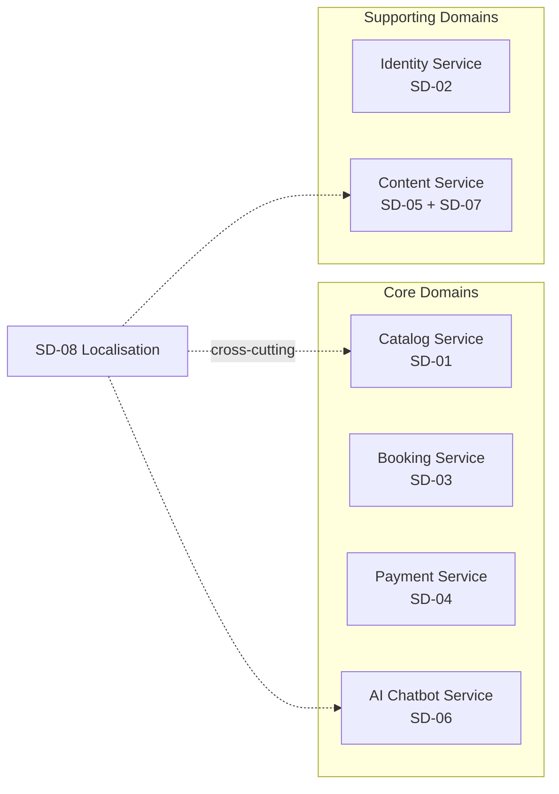
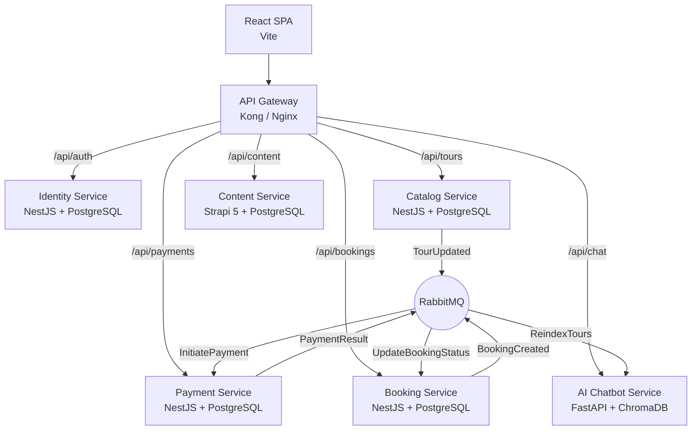
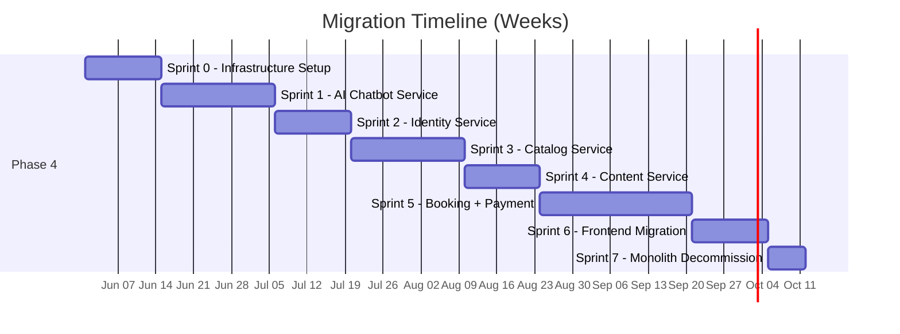
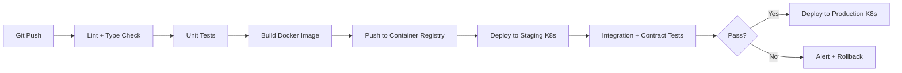

# Travel TVB — Microservices Refactoring Plan (7-Phase SDLC)

> **Project**: Travel TVB Tour Guide & Booking Platform  
> **Current State**: Monolithic (React SPA + Strapi 5 + SQLite + ChromaDB)  
> **Target State**: Microservices Architecture  
> **Date**: May 12, 2026

---

## Executive Summary

This plan details the refactoring of Travel TVB from a monolithic architecture into 6 independent microservices using the **Strangler Fig Pattern**. The plan follows the 7 phases of the SDLC and is estimated at **20–26 weeks** with a 3-person team.

---

## Phase 1: Planning & Requirements Analysis

### 1.1 Current State Assessment

| Layer | Technology | Pain Points |
|-------|-----------|-------------|
| **Frontend** | React 19 SPA (Vite 7) | Tightly coupled to single Strapi API origin |
| **Backend** | Strapi 5.36 (Node.js) | Single process handles Auth, CMS, Booking, Payment, AI — no independent scaling |
| **Database** | SQLite (better-sqlite3) | Single file DB; no concurrent write scaling; no isolation between domains |
| **AI** | Gemini + ChromaDB (in-process) | Python-native ML ecosystem inaccessible; ChromaDB client inside Node.js |
| **Deployment** | Single server | One failure takes down everything |

### 1.2 Refactoring Goals

| # | Goal | Measurable Outcome |
|---|------|--------------------|
| G1 | Independent Scalability | Catalog & AI services scale to 3x replicas without affecting others |
| G2 | Fault Isolation | Payment service outage does not impact tour browsing or chatbot |
| G3 | Technology Freedom | AI service runs Python/FastAPI; transactional services use Node.js/NestJS |
| G4 | Team Autonomy | Each service has independent CI/CD pipeline; deploy without coordination |
| G5 | Zero User Disruption | All 29 user stories (G-01→A-07) remain fully functional throughout migration |

### 1.3 Stakeholder Requirements

- **Functional**: All existing workflows BW-01 through BW-08 must be preserved
- **Non-Functional**: P99 latency ≤ 500ms, 99.9% uptime, data consistency across services
- **Constraints**: Budget for managed Kubernetes; team of 3 developers; VNPay sandbox compatibility

### 1.4 Risk Assessment

| Risk | Probability | Impact | Mitigation |
|------|------------|--------|------------|
| Data loss during migration | Medium | Critical | Blue-green migration with rollback scripts |
| Distributed transaction failures | High | High | Saga pattern with compensation events |
| Increased latency from network hops | Medium | Medium | Service mesh, connection pooling, caching |
| Team learning curve (K8s, message brokers) | High | Medium | Spike weeks for training before implementation |

### 1.5 Deliverables

- [x] Current architecture audit document
- [ ] Approved microservices boundary map
- [ ] Risk register with owners
- [ ] Project timeline with milestones

---

## Phase 2: System Analysis & Domain Decomposition

### 2.1 Bounded Context Mapping

Based on the 8 subdomains identified in the monolith (SD-01 through SD-08), the system decomposes into **6 deployable microservices**:



### 2.2 Service Inventory

| # | Service | Bounded Context | Entities | Current Strapi Modules |
|---|---------|----------------|----------|----------------------|
| 1 | **Identity Service** | SD-02 | User, Role, JWT, Session | `users-permissions` plugin |
| 2 | **Catalog Service** | SD-01 | Tour, TourCategory, Region, Itinerary, Highlight, Gallery, Pricing | `api/tour`, `api/tour-category` |
| 3 | **Booking Service** | SD-03 | Booking, TravelDate, ContactInfo, BookingStatus, RefundInfo | `api/booking` (create, cancel, myBookings) |
| 4 | **Payment Service** | SD-04 | PaymentRequest, VNPayURL, HMACSignature, PaymentCallback | `api/booking` (createPaymentUrl, vnpayReturn, processVnpayRefund) |
| 5 | **Content Service** | SD-05 + SD-07 | BlogPost, CommunityPost, FAQ, PageSection, Contact, Newsletter | 14 Strapi content-types (about-*, home-*, layout-*, single-post, etc.) |
| 6 | **AI Chatbot Service** | SD-06 | ChatMessage, TourChunk, VectorIndex, ConversationHistory | `api/chatbot`, `scripts/index-tours.js` |

### 2.3 Data Ownership Matrix

| Data Entity | Owner Service | Consumers | Access Pattern |
|------------|--------------|-----------|----------------|
| User/Auth | Identity | All services (via JWT) | Sync (JWT validation) |
| Tour | Catalog | Booking, AI, Frontend | Sync (REST) + Async (events) |
| Booking | Booking | Payment, Frontend | Sync (REST) + Async (Saga) |
| Payment | Payment | Booking (callback) | Async (events) |
| Blog/FAQ/Pages | Content | Frontend | Sync (REST) |
| Embeddings | AI Chatbot | Frontend | Sync (REST) |

### 2.4 API Dependency Graph

```
Frontend → API Gateway → Identity (auth middleware)
                       → Catalog (tour CRUD/read)
                       → Booking (create, list, cancel)
                       → Payment (create URL, VNPay callback)
                       → Content (CMS pages)
                       → AI Chatbot (query)

Booking ──event──→ Payment (BookingCreated → InitiatePayment)
Payment ──event──→ Booking (PaymentCompleted → UpdateStatus)
Catalog ──event──→ AI Chatbot (TourUpdated → ReindexEmbeddings)
```

---

## Phase 3: Architectural Design

### 3.1 High-Level Architecture



### 3.2 Design Patterns

| Pattern | Where Applied | Purpose |
|---------|--------------|---------|
| **API Gateway** | Kong/Nginx in front of all services | Single entry point, routing, rate limiting, SSL termination |
| **Database-per-Service** | Each service has its own PostgreSQL schema/instance | Loose coupling, independent schema evolution |
| **Strangler Fig** | Migration strategy | Incrementally route traffic from monolith to new services |
| **Saga (Choreography)** | Booking ↔ Payment | Distributed transaction management via events |
| **CQRS** | Catalog Service | Separate read-optimized queries from write operations |
| **Circuit Breaker** | Payment → VNPay calls | Prevent cascade failures when VNPay is down |
| **Event Sourcing** | Booking status transitions | Audit trail for Pending→Paid→Cancelled state machine |

### 3.3 Inter-Service Communication

| Type | Protocol | Use Cases |
|------|----------|-----------|
| **Synchronous** | REST (JSON) / gRPC | Frontend→Gateway→Service; Service→Service queries |
| **Asynchronous** | RabbitMQ (AMQP) | BookingCreated, PaymentResult, TourUpdated events |
| **Auth Propagation** | JWT in `Authorization` header | Gateway validates JWT via Identity Service, passes user context |

### 3.4 Database Design

| Service | Database | Schema |
|---------|----------|--------|
| Identity | PostgreSQL `identity_db` | users, roles, permissions |
| Catalog | PostgreSQL `catalog_db` | tours, categories, regions, itineraries, highlights, galleries |
| Booking | PostgreSQL `booking_db` | bookings, booking_contacts, refunds |
| Payment | PostgreSQL `payment_db` | payments, vnpay_transactions, refund_requests |
| Content | PostgreSQL `content_db` | Strapi-managed tables (posts, pages, FAQs, etc.) |
| AI Chatbot | ChromaDB + Redis | Vector embeddings, session cache |

### 3.5 Frontend Adaptation

The React SPA requires minimal changes:
- Replace `VITE_API_URL=http://localhost:1337` with API Gateway URL
- All existing API paths remain the same (gateway routes transparently)
- Add retry logic for transient failures

---

## Phase 4: Development & Implementation

### 4.1 Strangler Fig Migration Order

The services are extracted in order of **lowest coupling → highest coupling**:



### 4.2 Sprint 0 — Infrastructure Setup (Weeks 1–2)

**Deliverables:**
- Docker Compose for local development (all 6 services + PostgreSQL + RabbitMQ + ChromaDB)
- API Gateway (Kong) configuration with route stubs
- PostgreSQL instances provisioned (one per service)
- RabbitMQ with exchanges: `booking.events`, `catalog.events`, `payment.events`
- CI/CD pipeline templates (GitHub Actions: lint → test → build → push image)
- Shared libraries: JWT validation middleware, event publisher/consumer, logging format

### 4.3 Sprint 1 — AI Chatbot Service Extraction (Weeks 3–5)

**Why first**: Lowest coupling — standalone Python service with no write dependencies.

**Steps:**
1. Create FastAPI project with `/api/chat/query` endpoint
2. Port `chatbot.js` controller logic → Python (rate limiter, input validation)
3. Port `chatbot.js` service logic → Python (Gemini embedding, ChromaDB search, RAG prompt)
4. Port `vectorStore.js` → Python ChromaDB client
5. Port `index-tours.js` → Python indexing script (fetches tours from Catalog Service API)
6. Configure API Gateway: `/api/chatbot/*` → AI Chatbot Service
7. Remove chatbot code from Strapi monolith

**Key files migrated:**
- `Travel_TVB_Server/src/api/chatbot/controllers/chatbot.js` (150 lines)
- `Travel_TVB_Server/src/api/chatbot/services/chatbot.js` (5.7 KB)
- `Travel_TVB_Server/src/api/chatbot/services/vectorStore.js` (6.6 KB)

### 4.4 Sprint 2 — Identity Service (Weeks 6–7)

**Steps:**
1. Create NestJS project with auth modules (register, login, JWT, roles)
2. Migrate user data from SQLite → PostgreSQL (migration script)
3. Implement JWT issuance compatible with current frontend `AuthContext.jsx`
4. API Gateway auth middleware: validate JWT on every request, inject `X-User-Id` header
5. Route `/api/auth/*` → Identity Service
6. Disable Strapi `users-permissions` plugin routes

### 4.5 Sprint 3 — Catalog Service (Weeks 8–10)

**Steps:**
1. Create NestJS project with Tour, TourCategory, Region modules
2. Migrate tour schema + data from SQLite → PostgreSQL
3. Implement REST API matching current Strapi tour endpoints (with `?locale=` support)
4. Publish `TourUpdated` event to RabbitMQ when tour is created/updated/deleted
5. AI Chatbot Service subscribes to `TourUpdated` → triggers re-indexing
6. Route `/api/tours/*`, `/api/tour-categories/*` → Catalog Service

### 4.6 Sprint 4 — Content Service (Weeks 11–12)

**Steps:**
1. Keep Strapi 5 as a dedicated Content/CMS service
2. Migrate content tables from SQLite → PostgreSQL
3. Remove non-content APIs from Strapi (booking, chatbot, tour)
4. Strapi now only manages: blogs, community posts, FAQ, page sections, about, services
5. Route `/api/single-posts/*`, `/api/faqs/*`, `/api/home-*`, etc. → Content Service

### 4.7 Sprint 5 — Booking & Payment Services (Weeks 13–16)

**Why last**: Highest coupling — distributed transaction between Booking and Payment.

**Booking Service:**
1. Create NestJS project with Booking module
2. Port `booking.js` controller (599 lines): create, myBookings, cancelBooking, getAvailability
3. Publish `BookingCreated` event after booking creation
4. Subscribe to `PaymentCompleted` / `PaymentFailed` events to update booking status

**Payment Service:**
1. Create NestJS project with Payment module
2. Port VNPay logic: `createPaymentUrl`, `vnpayReturn`, `processVnpayRefund`
3. Port `vnpay-helpers.js` utilities
4. Subscribe to `BookingCreated` → no action (payment initiated by frontend)
5. Publish `PaymentCompleted` / `PaymentFailed` after VNPay callback verification

**Saga Flow:**
```
1. Frontend → Booking Service: POST /api/bookings (creates booking, status=Pending)
2. Frontend → Payment Service: POST /api/payments/create-url {bookingId}
3. Payment Service → VNPay: redirect user
4. VNPay → Payment Service: GET /api/payments/vnpay-return (callback)
5. Payment Service → RabbitMQ: PaymentCompleted {bookingId, transactionNo}
6. Booking Service ← RabbitMQ: updates status to Paid
```

### 4.8 Sprint 6 — Frontend Migration (Weeks 17–18)

1. Update `VITE_API_URL` to API Gateway URL
2. Update API service files to use new endpoint paths (if changed)
3. Add error handling for service-specific failures (graceful degradation)
4. Test all 16 pages and 8 global components against new backend

### 4.9 Sprint 7 — Monolith Decommission (Week 19)

1. Remove all API routes from Strapi monolith (except Content Service)
2. Archive old SQLite database
3. Update DNS/proxy to point exclusively to API Gateway
4. Monitor for 1 week before removing old server

---

## Phase 5: Testing Strategy

### 5.1 Testing Pyramid

```
          ┌─────────┐
          │  E2E    │  ← 5% — Playwright (BW-01 to BW-08 flows)
         ┌┴─────────┴┐
         │ Contract   │  ← 15% — Pact (API contracts between services)
        ┌┴───────────┴┐
        │ Integration  │  ← 30% — DB, RabbitMQ, external APIs
       ┌┴─────────────┴┐
       │  Unit Tests    │  ← 50% — Jest (Node), PyTest (Python)
       └───────────────┘
```

### 5.2 Testing by Service

| Service | Unit Framework | Integration | Contract | Coverage Target |
|---------|---------------|-------------|----------|-----------------|
| Identity | Jest + NestJS Testing | PostgreSQL testcontainer | Pact provider | ≥ 80% |
| Catalog | Jest + NestJS Testing | PostgreSQL + RabbitMQ | Pact provider | ≥ 80% |
| Booking | Jest + NestJS Testing | PostgreSQL + RabbitMQ | Pact provider + consumer | ≥ 85% |
| Payment | Jest + NestJS Testing | PostgreSQL + VNPay mock | Pact provider + consumer | ≥ 85% |
| Content | Jest (Strapi) | PostgreSQL | Pact provider | ≥ 70% |
| AI Chatbot | PyTest | ChromaDB + Gemini mock | Pact provider | ≥ 75% |

### 5.3 E2E Test Scenarios

| Test ID | Workflow | Scenario |
|---------|----------|----------|
| E2E-01 | BW-01 | Browse tours → filter by region → view detail |
| E2E-02 | BW-02 | Register → login → persistent session |
| E2E-03 | BW-03 | Login → book tour → VNPay payment → success screen |
| E2E-04 | BW-04 | View profile → cancel paid booking → verify refund |
| E2E-05 | BW-05 | Open chatbot → ask question → verify grounded response |
| E2E-06 | BW-07 | Switch language → verify all content updates |

### 5.4 Chaos Testing

| Scenario | Expected Behavior |
|----------|-------------------|
| Payment Service crashes | Booking stays Pending; user can retry; catalog/chatbot unaffected |
| RabbitMQ goes down | Services buffer events; retry with exponential backoff |
| Catalog DB is slow | Circuit breaker opens; cached data served; degraded mode |
| AI Service OOM | Chatbot returns fallback message; all other features work |

---

## Phase 6: Deployment & CI/CD

### 6.1 Containerization

Each service gets its own `Dockerfile`:

```
services/
├── identity-service/    → Dockerfile, package.json, src/
├── catalog-service/     → Dockerfile, package.json, src/
├── booking-service/     → Dockerfile, package.json, src/
├── payment-service/     → Dockerfile, package.json, src/
├── content-service/     → Dockerfile (Strapi), package.json, src/
├── ai-chatbot-service/  → Dockerfile (Python), requirements.txt, app/
├── api-gateway/         → kong.yml or nginx.conf
└── docker-compose.yml   → Local development stack
```

### 6.2 CI/CD Pipeline (per service)



### 6.3 Kubernetes Architecture

| Component | K8s Resource | Replicas |
|-----------|-------------|----------|
| API Gateway | Ingress Controller (Kong) | 2 |
| Identity Service | Deployment + Service | 2 |
| Catalog Service | Deployment + Service + HPA | 2–5 |
| Booking Service | Deployment + Service | 2 |
| Payment Service | Deployment + Service | 2 |
| Content Service | Deployment + Service | 2 |
| AI Chatbot Service | Deployment + Service + HPA | 2–4 |
| PostgreSQL | StatefulSet (or managed RDS) | 1 per service |
| RabbitMQ | StatefulSet (or managed) | 3 (cluster) |
| ChromaDB | StatefulSet | 1 |

### 6.4 Environment Strategy

| Environment | Purpose | Infrastructure |
|-------------|---------|---------------|
| **Local** | Development | Docker Compose |
| **Staging** | Integration testing | K8s namespace `staging` |
| **Production** | Live users | K8s namespace `production` |

---

## Phase 7: Maintenance & Operations

### 7.1 Observability Stack

| Pillar | Tool | Implementation |
|--------|------|---------------|
| **Logging** | ELK Stack | All services log to stdout → Fluentbit DaemonSet → Elasticsearch |
| **Tracing** | OpenTelemetry + Jaeger | `trace_id` injected at API Gateway, propagated via headers |
| **Metrics** | Prometheus + Grafana | Each service exposes `/metrics`; Prometheus scrapes; Grafana dashboards |
| **Alerting** | Grafana Alerting | High error rate, P99 latency > 500ms, service down |

### 7.2 Key Dashboards

| Dashboard | Metrics |
|-----------|---------|
| Service Health | Request rate, error rate, latency P50/P95/P99 per service |
| Booking Pipeline | Bookings created/min, payment success rate, avg time to payment |
| AI Chatbot | Queries/min, avg response time, ChromaDB query latency |
| Infrastructure | CPU, memory, pod count, RabbitMQ queue depth |

### 7.3 Operational Runbooks

| Scenario | Runbook |
|----------|---------|
| Service won't start | Check logs → verify DB connection → check config/secrets |
| RabbitMQ queue backlog | Check consumer health → scale consumers → inspect dead letter queue |
| Database migration failure | Rollback migration → fix script → re-apply |
| VNPay callback failures | Check Payment Service logs → verify HMAC → check VNPay status page |

### 7.4 Database Maintenance

- **Automated backups**: Daily PostgreSQL pg_dump to S3; 30-day retention
- **ChromaDB snapshots**: Weekly export of vector collections
- **Schema migrations**: Managed via TypeORM migrations (NestJS) or Alembic (Python)
- **Monitoring**: Slow query logs, connection pool usage, disk space alerts

### 7.5 Security Maintenance

- Regular dependency vulnerability scanning (npm audit, pip audit)
- JWT secret rotation schedule (quarterly)
- API Gateway rate limiting configuration review
- Annual penetration testing

---

## Timeline Summary

| Phase | Duration | Key Milestone |
|-------|----------|---------------|
| Phase 1: Planning | Week 1 | Requirements approved |
| Phase 2: Analysis | Week 2 | Service boundaries finalized |
| Phase 3: Design | Weeks 3–4 | Architecture document signed off |
| Phase 4: Development | Weeks 5–19 | All 6 services deployed; monolith decommissioned |
| Phase 5: Testing | Weeks 5–20 | (Parallel with Phase 4) All tests passing |
| Phase 6: Deployment | Weeks 5–20 | (Parallel with Phase 4) CI/CD operational |
| Phase 7: Maintenance | Week 20+ | Observability stack live; runbooks documented |

**Total estimated duration: 20–26 weeks**

---

## Success Criteria

| Criteria | Measurement |
|----------|-------------|
| All 29 user stories functional | E2E tests pass for BW-01 through BW-08 |
| Independent deployability | Each service deploys without affecting others |
| Fault isolation verified | Chaos test: Payment down → Catalog + Chatbot respond normally |
| Performance maintained | P99 latency ≤ 500ms for all endpoints |
| Test coverage | ≥ 80% unit test coverage per service |
| Zero data loss | All SQLite data successfully migrated to PostgreSQL |
